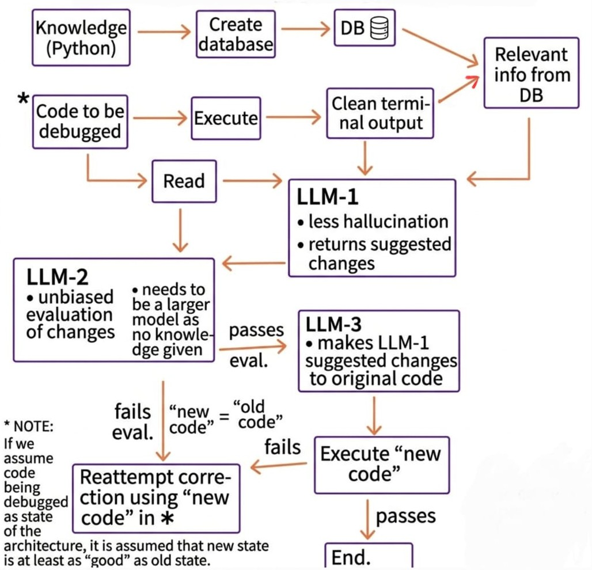

# Debugging-Agent

A multi-agent debugging framework that implements a **Suggestor-Evaluator-Corrector** pipeline. This modular system uses Retrieval-Augmented Generation (RAG) and LLM orchestration to automatically identify and fix runtime errors in Python code.

## Quick Start

### 1. Environment Setup

Clone and navigate to the project:

```powershell
cd Debugging-Agent
python -m venv venv
.\venv\Scripts\Activate.ps1
```

### 2. Install Dependencies

```powershell
pip install -r requirements.txt
```

### 3. Build Vector Database

The system uses Python 3.11 documentation for RAG-based retrieval. Build the Chroma vector store:

```powershell
python -m database_creation
```

This creates the vector embeddings from Python documentation and stores them locally.

### 4. Start Docker Service

Navigate to the Docker directory and start the vector database service:

```powershell
cd docker_dataset
docker compose up -d
cd ..
```

### 5. Run Debugging Agent

Debug a Python file with automatic error correction:

```powershell
python -m debugging_agent --file="path/to/your/file.py" --max_attempts=7
```

**Parameters:**
- `--file`: Path to the Python file to debug (example: `./debugging_agent/sample.py`)
- `--max_attempts`: Maximum correction attempts (default: 3)

### 6. Stop Services

When finished:

```powershell
cd docker_dataset
docker compose down
cd ..
```

## Architecture



## License

See [LICENSE](LICENSE) file for licensing information.

---

**For detailed debugging information**, check the timestamped log files in the `logs/` directory. Each run creates a new log file with comprehensive execution traces.
